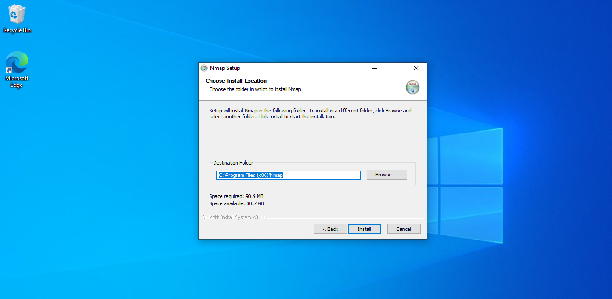
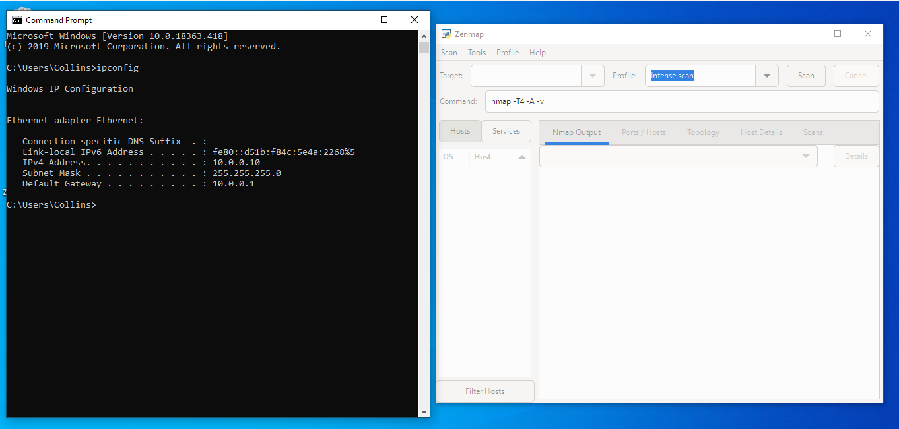
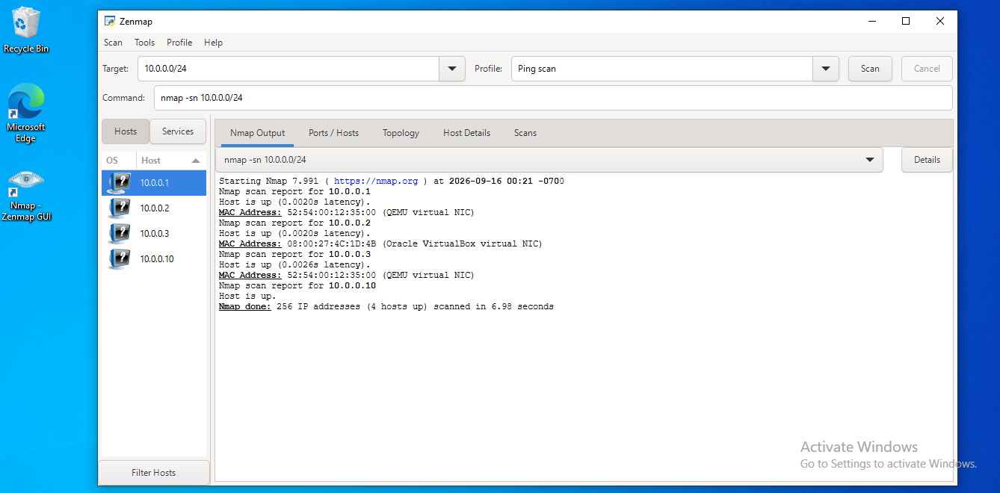
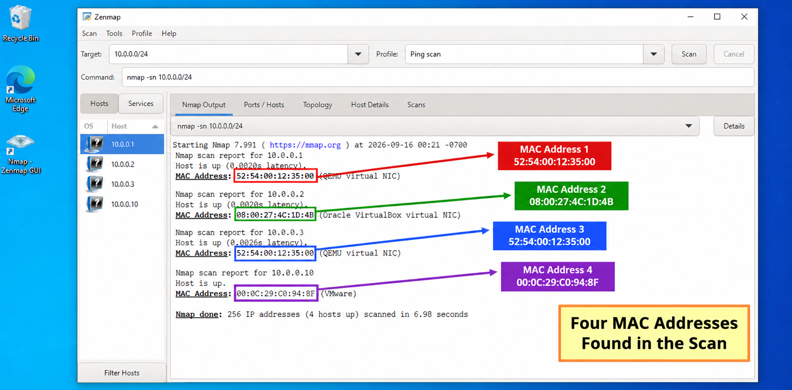
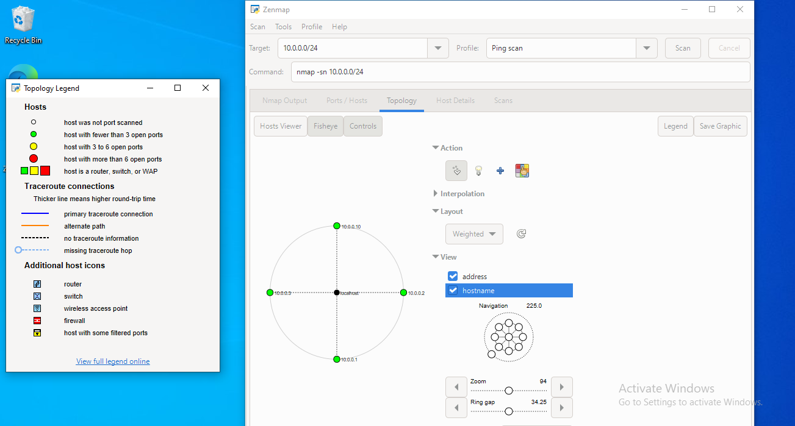
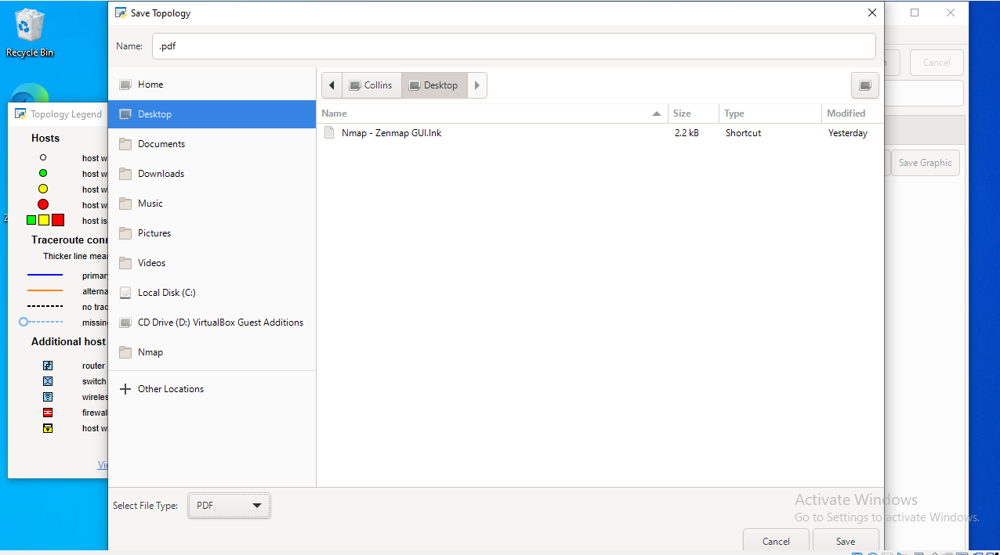
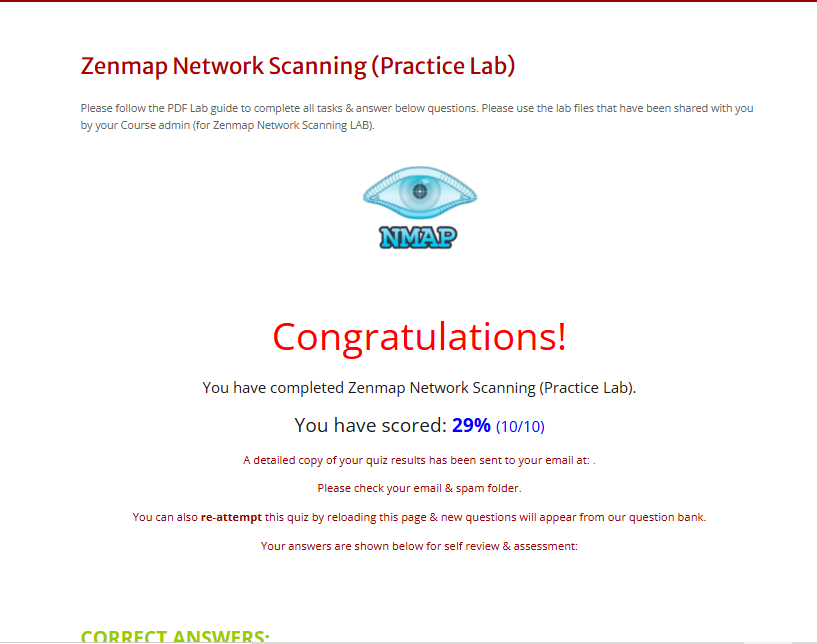
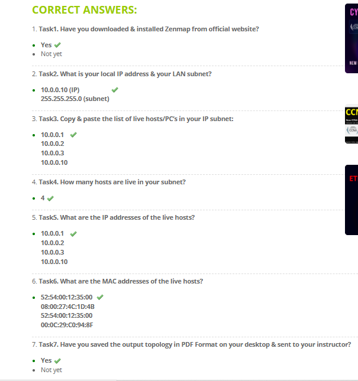

<div align="center">

# 🌐 Network Scanning with Zenmap

**Practical network discovery and topology mapping using Zenmap and Nmap**
</div>

<p align="center">
  
  
  
  
  
</p>

---

## 📌 Project Overview

This project covers practical **network scanning with Zenmap**, the graphical interface for Nmap.

The exercise focused on identifying the local IP address and LAN subnet, discovering live hosts, recording their IP and MAC addresses, using Zenmap's **Topology** view, and completing the questions provided on the NetworkWalks lab page.

---

## 🎯 Objectives

- Install and configure Zenmap.
- Identify the local IP address and LAN subnet.
- Perform a Ping Scan to discover live hosts.
- Record the IP addresses of discovered hosts.
- Identify MAC addresses returned by the scan.
- Use Zenmap Topology to visualize the network.
- Save the network topology as a PDF.
- Complete the NetworkWalks lab questions.
- Document the work with screenshots and evidence.

---

# 🪜 Network Scanning Procedure

## Step 1. Download & Install Zenmap

Zenmap was installed on the Windows system and used as the graphical interface for Nmap network scanning.

**Note:** This step established the graphical scanning environment used for the remaining tasks.

**Official Nmap download:** https://nmap.org/download.html

**Result:**

Zenmap was successfully installed and ready for network scanning.

**Screenshot:**



---

## Step 2. Find Local IP Address & LAN Subnet

The Windows Command Prompt was used to inspect the local network configuration.

```cmd
ipconfig
```

**Result:**

```text
Local IP: 10.0.0.10
LAN Subnet: 255.255.255.0
Network: 10.0.0.0/24
```

**Note:** Identifying the local subnet provided the correct network range to use for the Zenmap scan.

**Screenshot:**



---

## Step 3. Find Live Hosts in the IP Subnet

Zenmap was configured with the local subnet and the **Ping Scan** profile.

```text
nmap -sn 10.0.0.0/24
```

The scan identified four hosts that were up.

**Live hosts discovered:**

```text
10.0.0.1
10.0.0.2
10.0.0.3
10.0.0.10
```

**Note:** The Ping Scan was used for host discovery to determine which IP addresses were active on the local network.

**Screenshot:**



---

## Step 4. Number of Live Hosts

The Ping Scan reported:

```text
4 hosts up
```

This includes the local machine at `10.0.0.10`.

**Note:** Recording the host count provides a quick summary of the devices responding within the scanned subnet.

---

## Step 5. IP Addresses of Live Hosts

The scan returned the following live host IP addresses:

| Host | IP Address |
|---|---|
| Host 1 | `10.0.0.1` |
| Host 2 | `10.0.0.2` |
| Host 3 | `10.0.0.3` |
| Host 4 | `10.0.0.10` |

**Note:** These addresses identify the live hosts detected by the Ping Scan and can be used for further authorised network investigation.

---

## Step 6. Identify MAC Addresses

The Zenmap scan displayed MAC address information for the discovered hosts.

**Result:**

| IP Address | MAC Address |
|---|---|
| `10.0.0.1` | `52:54:00:12:35:00` |
| `10.0.0.2` | `08:00:27:4C:1D:4B` |
| `10.0.0.3` | `52:54:00:12:35:00` |
| `10.0.0.10` | `00:0C:29:C0:94:8F` |

**Note:** MAC addresses provide hardware-level identifiers for the interfaces observed during the scan. Two hosts in this scan reported the same MAC address.

**Screenshot:**



---

## Step 7. Display & Save Network Topology

Zenmap's **Topology** view was used to visualize the discovered hosts.

### Procedure

1. Open the **Topology** tab.
2. Enable the **Legend**.
3. Review the discovered hosts and network relationships.
4. Select **Save Graphic**.
5. Choose **PDF** as the output format.
6. Save the topology PDF.

**Note:** The topology view provides a graphical representation of the discovered network and creates an additional form of evidence alongside the scan output.

**Result:**

The network topology was displayed in Zenmap and successfully saved as a PDF.

**Topology Screenshot:**



**Topology PDF:**

[View the saved topology PDF](topology.pdf)

**Save Topology Evidence:**



---

## Step 8. Complete the NetworkWalks Lab Questions

After completing the network scanning tasks, the NetworkWalks lab page was used to answer the required questions.

**Lab Page:**

https://networkwalks.com/zenmap-network-scanning-practice-lab/

**Note:** This step shows the completion of the practical lab questions that follow the Zenmap scanning exercise. The supporting screenshots are provided below:

### 



### 



---

# 📊 Evidence Checklist

| ✅ Evidence | Status |
|---|---|
| Zenmap installation | ✅ |
| `ipconfig` output | ✅ |
| Ping Scan result | ✅ |
| Number of live hosts | ✅ |
| Live host IP addresses | ✅ |
| MAC address information | ✅ |
| Zenmap Topology view | ✅ |
| NetworkWalks lab questions | ✅ |
| Lab question screenshot | ✅ |

---

# 💡 What I Learned

Through this project, I learned how to use Zenmap and Nmap for basic network discovery, host identification, MAC address collection, topology visualization, and practical lab assessment.

### 1. Network Identification

I learned how to use `ipconfig` to identify the local IPv4 address and determine the network subnet.

### 2. Host Discovery

I learned how a Ping Scan can be used to identify live hosts within a network range.

### 3. IP & MAC Information

I learned how to document the IP addresses of discovered hosts and identify MAC addresses returned by the scan.

### 4. Network Topology

I learned how Zenmap's Topology view can provide a graphical representation of discovered hosts and their relationships.

### 5. Practical Assessment

I learned how practical scanning activities can be followed by lab questions that test understanding of the results and concepts covered in the exercise.

### 6. Security Documentation

I learned that recording commands, scan results, screenshots, and supporting evidence makes a cybersecurity project easier to understand and reproduce.

---

# 🔐 Security & Ethical Use

This project is for **educational and authorised security testing only**.

Network scanning should only be performed against systems and networks that are owned, provided for training, or explicitly authorised for testing.

---

# 🔗 Tools & Resources

- **Nmap / Zenmap:** https://nmap.org/download.html
- **NetworkWalks Zenmap Lab:** https://networkwalks.com/zenmap-network-scanning-practice-lab/
- **Command Prompt**

---

---

## 📌 Project Information

| Item | Details |
|---|---|
| Program Name | NetworkWalks Cybersecurity & Ethical Hacking |
| Batch | B083 |
| Week | 02 |
| Project | W2-PM5 |
| Project Title | Network Scanning with Zenmap |
| Author | Collins |

---

[← Back to NETWORKWALKS Internship](https://github.com/cyberlynz/NETWORKWALKS)
