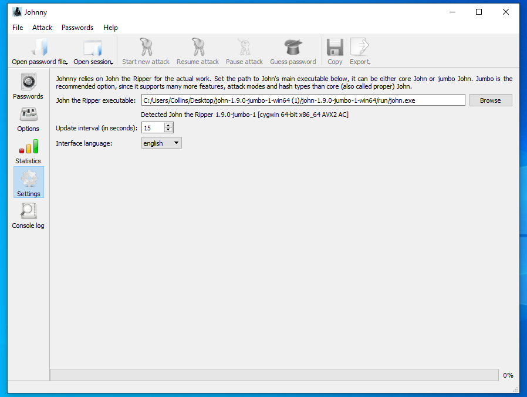
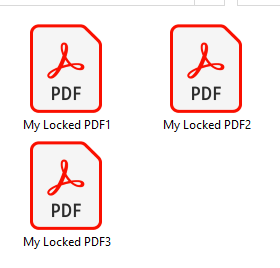
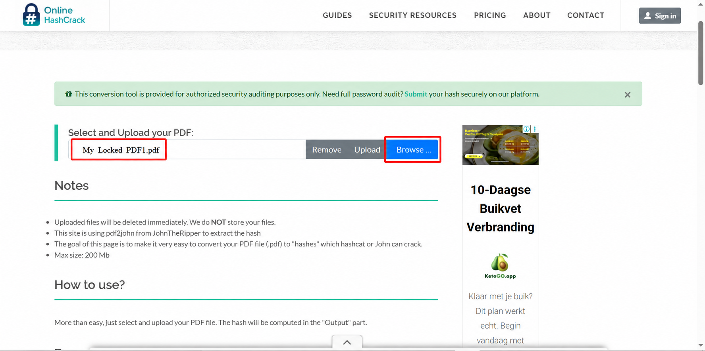
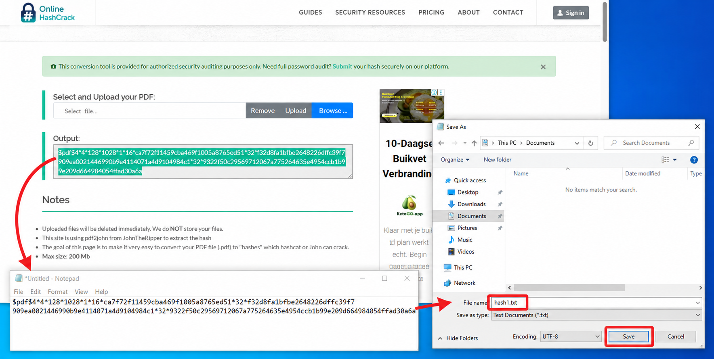
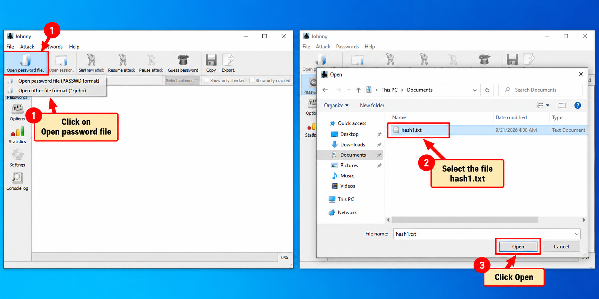
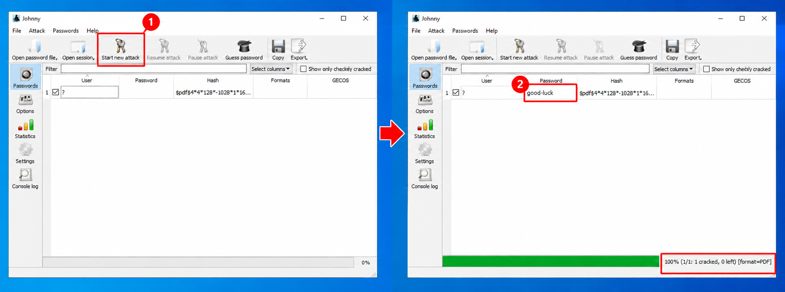
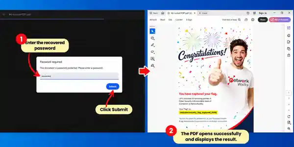

# 🔴 W3-PM1 — Password Cracking with JTR

**NetworkWalks Cybersecurity & Ethical Hacking — Batch B083**  
**Week 03 | Project Module 1**

---

## 📌 Introduction

During Week 03 of my NetworkWalks cybersecurity training, I completed a practical exercise focused on password recovery:

- **W3-PM1 — Password Cracking with JTR**

For the exercises, I worked with the supplied `My Locked PDF1.pdf`. I first examined how the protected PDF could be processed to obtain the information required for password recovery. I then used the assigned tools to perform the recovery process and checked the result by opening the document with the recovered password.

## 🎯 Objectives

By completing these practicals, I aimed to:

- Set up and use John the Ripper and Johnny.
- Extract a usable PDF hash from a protected document.
- Load a hash file into Johnny and initiate a password attack.
- Confirm whether the recovered password successfully opened the PDF.
- Gain practical experience with password-security testing in an authorized lab.

---

# 🔴 W3-PM1 — Password Cracking with JTR

## Background

Before starting the practical, I reviewed how John the Ripper is used in password-security testing. I also learned that **Johnny** provides a graphical interface for working with John the Ripper.

The practical required me to recover the password of the supplied protected PDF using JTR and Johnny on a Windows PC.

### Tools I Used

- John the Ripper
- Johnny GUI
- Windows PC
- `My Locked PDF1.pdf`
- PDF hash extractor

## My Practical Steps

### 1. Installing John the Ripper and Johnny

I started by installing John the Ripper and Johnny on my Windows PC.

The lab provided the following resources:

- John the Ripper: https://www.openwall.com/john/
- Johnny GUI: https://openwall.info/wiki/john/johnny

After installing Johnny, I opened its configuration and selected the location of **`john.exe`** in the JTR `run` folder.

### 2. Preparing the Protected PDF

I downloaded the supplied **`My Locked PDF1.pdf`** and confirmed that the document was password protected.

### 3. Extracting the PDF Hash

I used the PDF hash extraction process provided in the lab to obtain the hash required by the cracking tool.

The extracted value began with:

`$pdf$`

I copied the complete hash and saved it in a file named **`hash1.txt`**.

### 4. Loading the Hash File in Johnny

I opened Johnny and used the **Open password file** option to load **`hash1.txt`**.

### 5. Starting the Password Attack

I started a new password-cracking attack from Johnny.

During this stage, I noted that the time required for cracking can vary depending on factors such as password complexity and computer performance.

### 6. Checking the Recovered Password

After the attack completed, the lab demonstration showed the recovered password as:

**`password1`**

I entered the recovered password into the protected PDF and confirmed that the document opened successfully.

*I entered the recovered password and submitted it. The PDF then opened successfully and displayed the result.*

> **Note:** The same steps above were repeated for the other two protected PDF files. The recovered passwords from the three PDF cracking results were: **PDF 1 — `good-luck`**, **PDF 2 — `password1`**, and **PDF 3 — `1qaz2wsx`**.
---

# 🔄 Repeated Practice

> The same password-recovery steps were repeated for the other two protected PDF files. The recovered passwords from the JTR results were **PDF 1 — `good-luck`**, **PDF 2 — `password1`**, and **PDF 3 — `1qaz2wsx`**.

---

# 🔐 Security & Ethical Use

I performed this practical as part of a controlled cybersecurity training exercise.

The techniques covered in this project should only be used against files, systems, or accounts that I own or have explicit authorization to test. I carried out the exercise in the provided lab environment for learning and security-awareness purposes.

---

# 📚 References

- NetworkWalks — **W3-PM1: Password Cracking with JTR**
- John the Ripper: https://www.openwall.com/john/
- Johnny: https://openwall.info/wiki/john/johnny

---

## 📋 Project Information

| Item | Details |
|---|---|
| Training Program | NetworkWalks Cybersecurity & Ethical Hacking |
| Batch | B083 |
| Week | 03 |
| Module | W3-PM1 |
| Main Task | Password Cracking with JTR |
| Target File | `My Locked PDF1.pdf` |
| Platform | Windows PC |
| Author | Collins |
