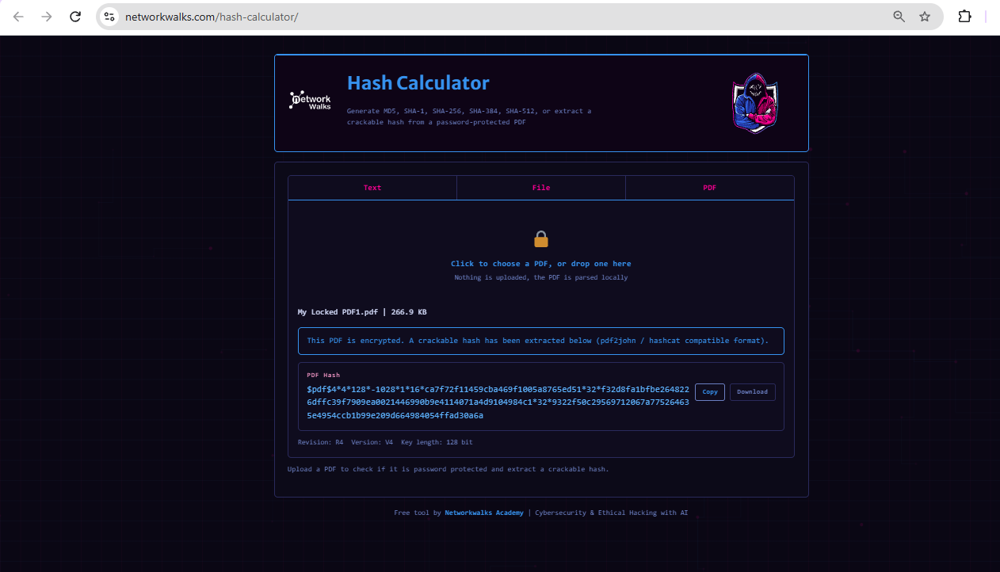
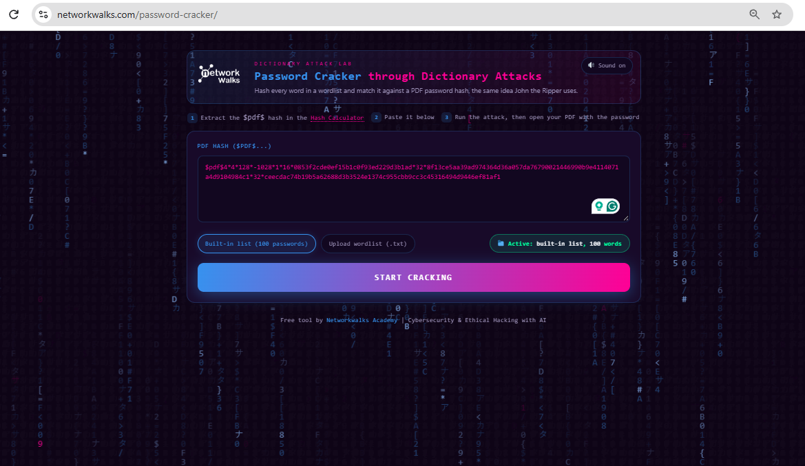
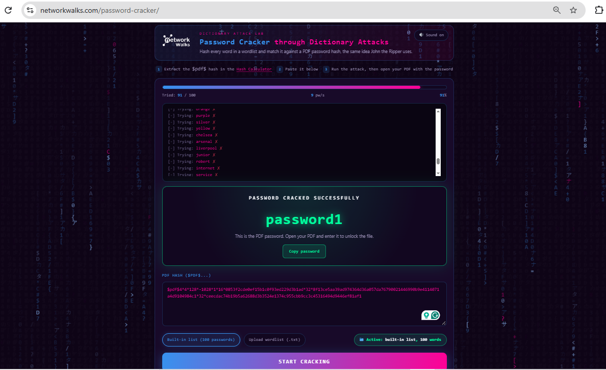
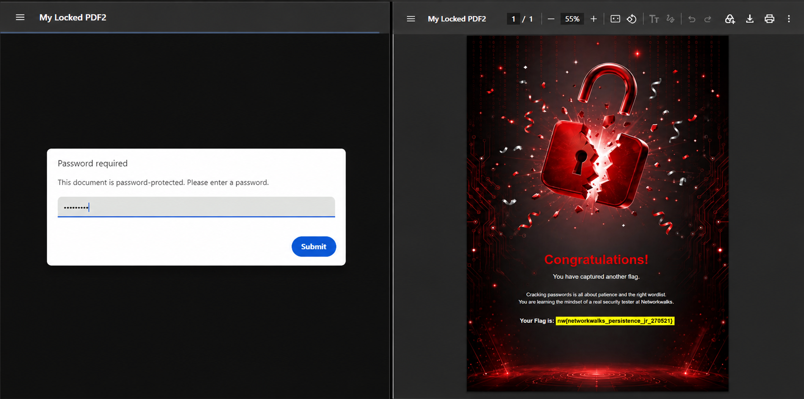

# 🔵 W3-PM2 — Password Cracking with NetworkWalks Tools

**NetworkWalks Cybersecurity & Ethical Hacking — Batch B083**  
**Week 03 | Project Module 2**


---

## 📌 Introduction

For **Week 03 | Project Module 2**, I completed a practical on **Password Cracking with NetworkWalks Tools**.

The task was to recover the password of the supplied protected PDF file **`My Locked PDF1.pdf`** using two NetworkWalks browser-based tools:

- **NetworkWalks Hash Calculator**
- **NetworkWalks Password Cracker**

The lab guide explains that the workflow is to extract the PDF hash first, copy the complete **`$pdf$`** hash, submit it to the Password Cracker, and then verify the recovered password by opening the protected PDF. 

---

## 🎯 Objectives

The practical objectives were to:

- Understand the basic password-recovery workflow for a protected PDF.
- Extract the PDF hash with the NetworkWalks Hash Calculator.
- Copy the complete hash beginning with **`$pdf$`**.
- Submit the hash to the NetworkWalks Password Cracker.
- Run the dictionary attack and observe the cracking process.
- Verify the recovered password by opening the protected PDF.

---

## 🛠️ Tools Used

| Tool | Purpose |
|---|---|
| NetworkWalks Hash Calculator | Extract the PDF hash |
| NetworkWalks Password Cracker | Recover the password from the hash |
| Web Browser | Access the NetworkWalks web tools |
| Windows Laptop | Lab platform |
| `My Locked PDF1.pdf` | Supplied protected PDF |

The lab guide specifically states that both NetworkWalks tools run in a web browser and do not require local installation. 

---

# 🧪 Practical Steps

### Step 1 — Download the Encrypted PDF

I downloaded the supplied **`My Locked PDF1.pdf`** from the NetworkWalks password-cracking lab page.

**Lab page:**  
https://networkwalks.com/project-task-lab-password-cracking-with-networkwalks-tools/

The lab task identifies **`My Locked PDF1.pdf`** as the file to be cracked. 

### Step 2 — Open the NetworkWalks Hash Calculator

I opened the NetworkWalks Hash Calculator in my browser.

**Tool:**  
https://networkwalks.com/hash-calculator/

### Step 3 — Upload the Locked PDF

I uploaded the protected PDF to the Hash Calculator.

The tool processed the file and produced a PDF hash beginning with **`$pdf$`**. The lab guide instructs the user to upload the locked PDF and obtain this PDF hash. 

**Evidence — Step 3:**



### Step 4 — Copy the Complete Hash

I copied the complete hash value, starting from **`$pdf$`**, without leaving out any part of the extracted value.

The lab specifically emphasizes copying the full hash beginning with **`$pdf$`**. 

### Step 5 — Open the NetworkWalks Password Cracker

I opened the NetworkWalks Password Cracker.

**Tool:**  
https://networkwalks.com/password-cracker/

### Step 6 — Submit the Hash and Start the Attack

I pasted the extracted PDF hash into the Password Cracker and started the attack.

The lab describes this as the stage where the tool tries different passwords until it finds a matching password.

**Evidence — Step 6:**



### Step 7 — Wait for the Result

I waited for the Password Cracker to complete the attack.

The lab notes that the time required depends on how simple or complex the password is.

**Evidence — Step 7:**



### Step 8 — Enter the Recovered Password

The password was recovered successfully as:

**`password1`**

The supplied lab guide shows **`password1`** as the recovered password and instructs the user to enter it into the locked PDF.

**Evidence — Step 8:**



### Step 9 — Verify the PDF

I entered the recovered password into the protected PDF and confirmed that the PDF opened successfully.

The lab guide identifies successful opening of the PDF as completion of the exercise.

---

## 🔄 Workflow

```text
Protected PDF
     │
     ▼
NetworkWalks Hash Calculator
     │
     ▼
Extract $pdf$ Hash
     │
     ▼
Copy Complete Hash
     │
     ▼
NetworkWalks Password Cracker
     │
     ▼
Start Dictionary Attack
     │
     ▼
Password Recovered
     │
     ▼
Open Protected PDF
     │
     ▼
Verify Access
```

This sequence follows the task instructions in the supplied lab guide.  

---

## 🧠 What I Learned

This practical helped me understand the complete password-recovery process for a protected PDF.

- I learned how a protected PDF can be processed to obtain a usable hash.
- I practiced extracting and copying a complete PDF hash.
- I used a web-based password-cracking tool to perform a dictionary attack.
- I observed that password complexity can affect cracking time.
- I verified the recovered password by opening the protected PDF.

The lab also explains the difference between encryption and hashing: encryption is described as reversible with the proper key, while hashing is described as a one-way process used to produce a message digest. 

---

## ✅ Results

| Stage | Result |
|---|---|
| Protected PDF Processing | Successful |
| PDF Hash Extraction | Successful |
| Complete Hash Submission | Successful |
| Password Cracking | Successful |
| Recovered Password | `password1` |
| PDF Verification | Successful |

---

## 🔐 Security & Ethical Use

This practical was completed as part of an authorized cybersecurity training exercise.

Password-recovery and cracking techniques should only be used against files, systems, or accounts that are owned by the tester or where explicit permission has been granted.

---

## 📚 References

- NetworkWalks — W3-PM2: Password Cracking with NetworkWalks Tools
- NetworkWalks Hash Calculator: https://networkwalks.com/hash-calculator/
- NetworkWalks Password Cracker: https://networkwalks.com/password-cracker/
- NetworkWalks Password Cracking Lab: https://networkwalks.com/project-task-lab-password-cracking-with-networkwalks-tools/

---

## 📋 Project Information

| Item | Details |
|---|---|
| Training Program | NetworkWalks Cybersecurity & Ethical Hacking |
| Batch | B083 |
| Week | 03 |
| Module | W3-PM2 |
| Main Task | Password Cracking with NetworkWalks Tools |
| Target File | `My Locked PDF1.pdf` |
| Platform | Windows Laptop / Web Browser |
| Author | Collins |
