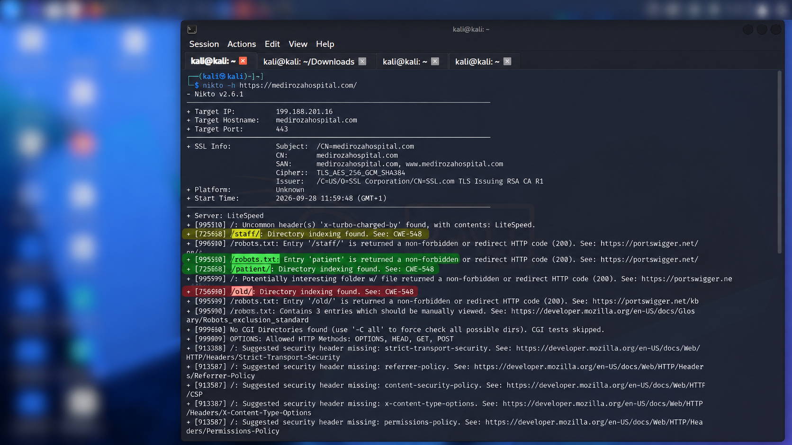
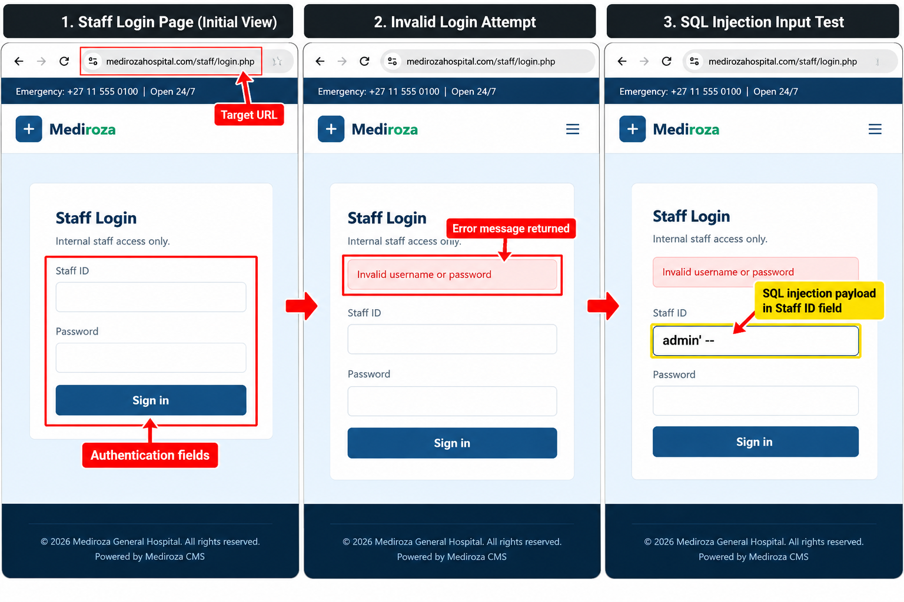
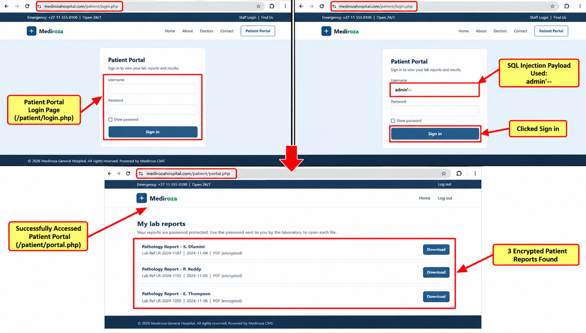

# 🏥 Penetration Testing Project — Mediroza General Hospital

**NetworkWalks Cybersecurity & Ethical Hacking — Batch B083**  
**Week 04 | Project Module (W4-PM)**

---

## 📌 Project Overview

For Week 04, I'm working on a full black-box penetration test against **Mediroza General Hospital**.

The engagement runs for **5 days** and follows the four milestones provided in the project brief. My work is centred on the target website, the three confidential patient PDF lab reports, the protected files recovered from the assessment, the further data exposure described in M3, and the final client report.

| | |
|---|---|
| Client | Mediroza General Hospital |
| Target | medirozahospital.com |
| Type | Black-box pentest |
| Duration | 5 days |
| Authorization | Written permission granted |
| Scope | Target domain only |

### Rules of Engagement

Testing is limited to the target domain.

- No social engineering.
- No denial of service.
- No testing outside the agreed scope.

---

## 🎯 Objectives

The project was divided into four milestones:

- **M1 — Initial Access:** Attack the website and retrieve 3 confidential patient PDF lab reports.
- **M2 — Data Extraction:** Crack the encryption on all 3 retrieved files.
- **M3 — Attack (cracking):** Find staff salaries and shareholder details of the hospital.
- **M4 — Pentest Report:** Write a professional penetration-testing report for the client.

---

# 🔎 M1 — Initial Access

**Written Permission: GRANTED**

## What I need to do

Attack the website and find the **3 confidential PDF lab reports of patients**.

## Hints

The brief directs me to:

- Conduct reconnaissance on the target.
- Identify exposed entry points.
- Analyse the behaviour of any authentication mechanisms I find.
- Look for weaknesses in how the application handles user input.
- Gain unauthorised access to a restricted area of the site.

## Reconnaissance

I started my reconnaissance with **Nikto v2.6.1** against:

`https://medirozahospital.com/`

The scan identified:

- **Target IP:** `199.188.201.16`
- **Port:** `443`
- **Web Server:** LiteSpeed

Nikto also identified directory indexing on:

- `/staff/`
- `/patient/`
- `/old/`

The scan also showed these paths in `/robots.txt`:

- `/staff`
- `/patient`
- `/old`

### Evidence

---

## Staff Login Testing

I followed the `/staff/` entry point and tested:

`https://medirozahospital.com/staff/login.php`

The page required:

- Staff ID
- Password

I made multiple login attempts and received:

**“Invalid username or password”**

I then tested the Staff ID input for **SQL injection**, but the attempts did not produce a successful authentication bypass or any useful result.

### Password Cracking

After extracting the crackable hashes, I used the **NetworkWalks Password Cracker** to recover the PDF passwords.

I tested the hashes against **multiple wordlists**. The attempts used the built-in password list and the **JTR_default_password.txt** wordlist, and successful matches were returned for the protected PDF files.

### Result

The hashes were successfully used in the password-cracking stage to recover the passwords needed to open the encrypted patient reports.

### Evidence

**02 — Staff Login, Authentication & SQL Injection Testing**

---

## Patient Portal Testing

I then tested the Patient Portal identified during reconnaissance:

`https://medirozahospital.com/patient/login.php`

I applied the same input-testing approach used on the staff login. This time, the test was successful and I gained access to:

`https://medirozahospital.com/patient/portal.php`

### Evidence

**03 — Patient Portal SQL Injection & Access**

The combined screenshot shows the Patient Portal login page, the SQL injection input, and the successful access to the portal.

## Retrieve the Patient Reports

After gaining access to the patient portal, I reached the **My lab reports** page.

The portal displayed three password-protected/encrypted PDF pathology reports:

1. **Pathology Report — S. Dlamini**  
   Lab Ref: `LR-2024-1187` | `2024-11-04` | PDF (encrypted)

2. **Pathology Report — P. Reddy**  
   Lab Ref: `LR-2024-1192` | `2024-11-05` | PDF (encrypted)

3. **Pathology Report — E. Thompson**  
   Lab Ref: `LR-2024-1205` | `2024-11-06` | PDF (encrypted)

Each report had a **Download** option.

---

# 🔐 M2 — Data Extraction

**Written Permission: GRANTED**

## What I need to do

Crack the encryption on all 3 retrieved files.

## What I Tried

I first tried **John the Ripper**, but it did not produce a result.

I then used the **NetworkWalks Hash Calculator** to extract a crackable hash from each encrypted PDF.

### Patient PDF Hash Extraction

I processed:

- `patient_report_1.pdf`
- `patient_report_2.pdf`
- `patient_report_3.pdf`

The Hash Calculator identified the files as encrypted and generated crackable hashes in **pdf2john / hashcat-compatible format**.

### Evidence

**04 — Patient PDF Hash Extraction**

### Password Cracking

After extracting the hashes, I used the **NetworkWalks Password Cracker** to recover the PDF passwords.

I tested the hashes against **multiple wordlists**. The cracking interface showed successful matches for the protected files.

The passwords recovered in the demonstrated attempts were:

| Patient PDF | Recovered Password |
|---|---|
| `patient_report_1.pdf` | `123456` |
| `patient_report_2.pdf` | `password` |
| `patient_report_3.pdf` | `!@#$%^&` |

### Evidence

**05 — Patient PDF Password Cracking**

The screenshot shows the successful password matches and the wordlists used during the cracking attempts.

### Result

The passwords for all three encrypted patient PDFs were recovered, completing the file recovery stage of M2.

# 🕵️ M3 — Critical Data Exposure

**Written Permission: GRANTED**

## What I need to do

Find the **critical data exposure on the client server**.

## Going Back Over What I've Got

After reviewing the reconnaissance results from Nikto, I went back to the exposed directories identified earlier.

The **`/old/`** directory contained an exposed database backup:

`mediroza_db_backup_2019.sql`

This became the lead for M3 because the database contained information relating to hospital staff and shareholders.

## What It Turned Out To Be

**Exposed resource:** `/old/mediroza_db_backup_2019.sql`

The database backup was directly accessible through the web directory and contained the information required for the M3 tasks.

## What I Found

### Monthly Salaries with Departments (ZAR, Highest First)

I extracted the employee salary information from the exposed database backup.

| Rank | Employee | Job title | Department | Salary (ZAR) |
|---|---|---|---|---:|
| 1 | Dr. Johan van der Merwe | Medical Director | Management | 160,000 |
| 2 | Sarah Botha | Chief Financial Officer | Finance | 152,000 |
| 3 | Dr. Rajesh Naidoo | Chief Pathologist | Diagnostics Lab | 138,000 |
| 4 | Dr. Vikram Chetty | Anaesthetist | Theatre | 135,000 |
| 5 | Dr. Anita Naicker | Consultant Cardiologist | Cardiology | 132,000 |
| 6 | Dr. Suresh Moodley | Consultant Radiologist | Radiology | 130,000 |
| 7 | Dr. Ahmed Kara | Consultant Physician | Internal Medicine | 128,000 |
| 8 | Dr. Fatima Patel | Pediatrician | Pediatrics | 118,000 |
| 9 | Michael Roberts | HR Director | Human Resources | 96,000 |
| 10 | Dr. Yusuf Cassim | Senior Registrar | Emergency & Trauma | 74,000 |
| 11 | Kagiso Sithole | Pharmacist | Pharmacy | 61,000 |
| 12 | Jameel Malik | IT Systems Administrator | IT | 58,000 |
| 13 | David Smith | Facilities Manager | Operations | 52,000 |
| 14 | Nisha Singh | Physiotherapist | Rehabilitation | 48,000 |
| 15 | Thabo Molefe | Network Engineer | IT | 46,000 |
| 16 | Themba Nkosi | Radiographer | Radiology | 44,000 |
| 17 | Palesa Radebe | Radiographer | Radiology | 43,000 |
| 18 | Zanele Mahlangu | Nursing Sister | Theatre | 42,000 |
| 19 | Deepak Pillay | Lab Technologist | Diagnostics Lab | 41,000 |
| 20 | Peter van Wyk | Procurement Officer | Supply Chain | 38,000 |
| 21 | Bongani Ndlovu | Registered Nurse | Cardiology | 35,000 |
| 21 | Kavitha Govender | Lab Technician | Diagnostics Lab | 35,000 |
| 23 | Nomvula Khumalo | Registered Nurse | Emergency & Trauma | 34,000 |
| 24 | Lerato Mokoena | Registered Nurse | Pediatrics | 33,000 |
| 25 | Susan Pretorius | HR Officer | Human Resources | 32,000 |
| 26 | Karen O'Connor | Billing Administrator | Finance | 29,000 |
| 27 | James Wilson | Security Supervisor | Operations | 27,000 |
| 28 | Naledi Zulu | Pharmacy Assistant | Pharmacy | 26,000 |
| 29 | Andile Mbeki | Ward Clerk | Administration | 21,000 |
| 30 | Linda Fourie | Receptionist | Front Office | 19,000 |

### Shareholder Details

I also used the exposed database to locate the shareholder details required by the assessment.

**Shareholder information:**  
____________________________________________

## Evidence

**06 — Exposed Database Backup**

The screenshot shows the exposed `/old/` directory and the `mediroza_db_backup_2019.sql` file.

Additional evidence for the extracted staff and shareholder information will be added as it is captured.

# 📝 M4 — Pentest Report

**Milestone 4**

## What I need to do

Bring M1 through M3 into one professional penetration-testing report.

## Structure I'm Following

| # | Section | What I will document |
|---|---|---|
| 01 | **Executive Summary** | Concise overview of the engagement, key findings, and overall risk to the client |
| 02 | **Scope and Methodology** | Target, tools used, approach taken, and any limitations encountered |
| 03 | **Findings and Proof of Exploitation** | Each vulnerability with screenshots and evidence for every milestone |
| 04 | **Risk Rating** | Critical, High, Medium, or Low with justification |
| 05 | **Recommendations and Remediation** | Actionable steps the client should take to fix each identified issue |

## Findings Summary

| Milestone | Vulnerability | Risk | Notes |
|---|---|---|---|
| M1 | | | |
| M2 | | | |
| M3 | | | |

## Deliverable

- [ ] Final penetration-testing report submitted to the instructor
- [ ] All supporting evidence from M1–M3 attached or linked

---

## ✅ Evidence Checklist

| Milestone | Deliverable | Evidence |
|---|---|---|
| M1 | Proof of access + 3 retrieved PDFs | ⬜ |
| M2 | Recovered contents of all 3 files | ⬜ |
| M3 | Evidence of the exposure + readable summary | ⬜ |
| M4 | Final penetration-testing report | ⬜ |

---

## 🧠 What I Learned

I'll complete this section after the practical work is finished so that it reflects what actually worked, what failed, and what I learned from the assessment rather than simply listing tools or repeating the project brief.

---

## 🔒 Security & Ethical Use

This project is being carried out in a controlled, authorised training environment. The techniques documented here are for authorised security testing only and should not be applied to any system without explicit written permission from the owner.

---

## 📋 Project Information

| | |
|---|---|
| Program | NetworkWalks Cybersecurity & Ethical Hacking |
| Batch | B083 |
| Week | 04 |
| Project | W4-PM |
| Project Title | Penetration Testing Project — Mediroza General Hospital |
| Target | medirozahospital.com |
| Author | Collins |

---

[← Back to NETWORKWALKS](../README.md)## Authentication & Input Testing

I first tested the staff login endpoint:

`https://medirozahospital.com/staff/login.php`

The login page required a **Staff ID** and **Password**. Multiple attempts returned:

**“Invalid username or password”**

I also tested the Staff ID input for SQL injection. The attempts did not produce a successful authentication bypass or any useful result.

### Patient Portal Testing

I then applied the same input-testing approach to the Patient Portal:

`https://medirozahospital.com/patient/login.php`

This test was successful and gave me access to:

`https://medirozahospital.com/patient/portal.php`

The portal displayed **three password-protected/encrypted PDF pathology reports**, each with a **Download** option:

- Pathology Report — S. Dlamini
- Pathology Report — P. Reddy
- Pathology Report — E. Thompson

This completed the M1 objective of obtaining the three confidential patient PDF reports required for the next stage.

### Result

- **Staff login:** No successful bypass
- **SQL injection on staff login:** No useful result
- **Patient Portal:** Access obtained
- **Patient reports:** 3 encrypted PDF reports identified and available for download

### Evidence

**02 — Staff Login, Authentication & SQL Injection Testing**

**03 — Patient Portal SQL Injection & Access**

The second screenshot combines the Patient Portal login, the SQL injection input test, and the successful portal access showing the three encrypted reports.

