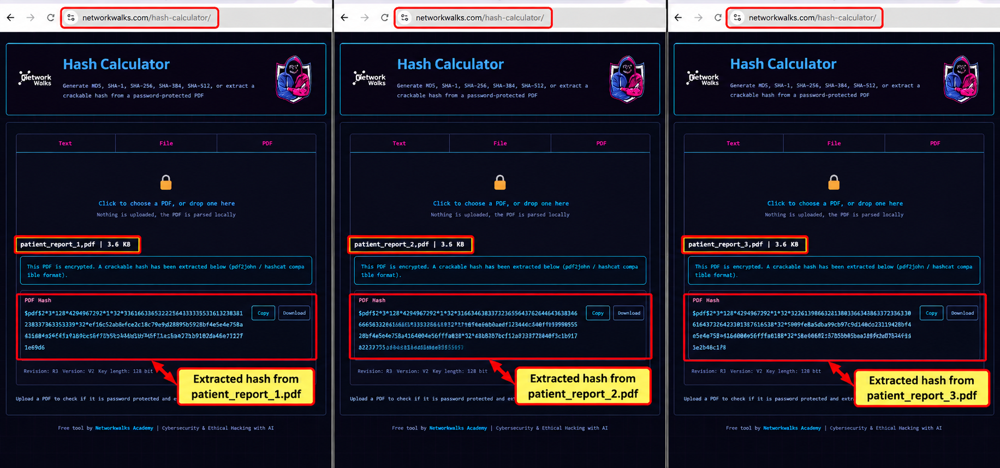
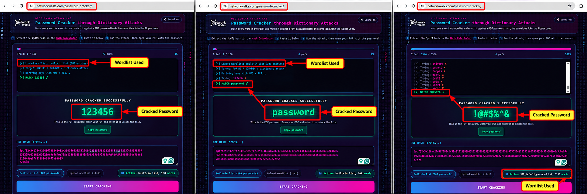
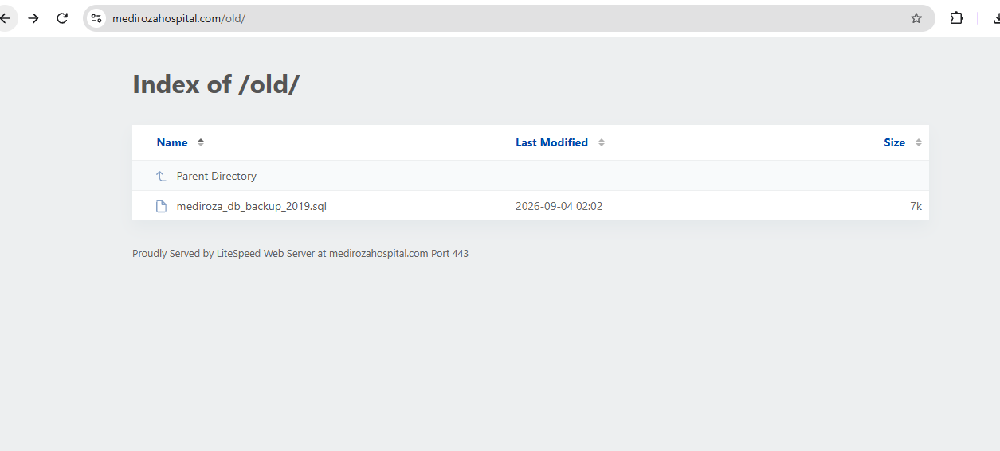

# 🏥 Penetration Testing Project — Mediroza General Hospital

**NetworkWalks Cybersecurity & Ethical Hacking — Batch B083**  
**Week 04 | Project Module (W4-PM)**

---

## 📌 Project Overview

For Week 04, I conducted a **full black-box penetration test** against the web infrastructure of **Mediroza General Hospital**.

The assessment focused on identifying weaknesses that could allow unauthorized access to restricted areas, exposure of confidential patient information, recovery of protected files, and access to sensitive hospital data.

| | |
|---|---|
| Client | Mediroza General Hospital |
| Target | https://medirozahospital.com/ |
| Target IP | 199.188.201.16 |
| Assessment Type | Full black-box penetration test |
| Duration | 5 days |
| Batch | B083-NetworkWalks |
| Date | 30 September 2026 |
| Authorization | Written permission granted |
| Scope | Target domain only |

### Rules of Engagement

Testing was limited to the authorized target domain.

- No social engineering.
- No denial-of-service testing.
- No testing outside the agreed scope.

---

## 🎯 Objectives

The project was divided into four milestones:

- **M1 — Initial Access:** Attack the website and retrieve 3 confidential patient PDF lab reports.
- **M2 — Data Extraction:** Crack the encryption on all 3 retrieved files.
- **M3 — Attack (cracking):** Find staff salaries and shareholder details.
- **M4 — Pentest Report:** Write a professional penetration-testing report for the client.

---

# 🔎 M1 — Initial Access

## What I needed to do

Attack the website and retrieve the **3 confidential patient PDF lab reports**.

## Hints

The project brief directed me to:

- Conduct reconnaissance on the target.
- Identify exposed entry points.
- Analyse the behaviour of authentication mechanisms.
- Look for weaknesses in how the application handles user input.
- Gain unauthorized access to a restricted area.

## Reconnaissance

I started with **Nikto v2.6.1** against:

**https://medirozahospital.com/**

The scan identified:

- **Target IP:** 199.188.201.16
- **Port:** 443
- **Web Server:** LiteSpeed

Nikto also identified directory indexing on:

- **/staff/**
- **/patient/**
- **/old/**

These paths were also shown in **robots.txt**.

### Evidence

---

## Staff Login and Authentication Testing

I investigated the Staff Login at:

**https://medirozahospital.com/staff/login.php**

The page required:

- Staff ID
- Password

I made multiple authentication attempts and tested the **Staff ID** field for SQL injection. The attempts returned:

**“Invalid username or password.”**

The SQL injection testing did not produce a successful authentication bypass or any useful result.

### Evidence

---

## Patient Portal Testing

I then tested the Patient Portal identified during reconnaissance:

**https://medirozahospital.com/patient/login.php**

I applied the same input-testing approach used on the staff login. This time, I was able to gain access to:

**https://medirozahospital.com/patient/portal.php**

The portal contained three password-protected/encrypted patient laboratory reports.

### Evidence

---

## Retrieved Patient Reports

After gaining access to the patient portal, I reached the **My lab reports** page.

The portal displayed:

1. **Pathology Report — S. Dlamini**  
   Lab Ref: **LR-2024-1187** | **2024-11-04** | PDF (encrypted)

2. **Pathology Report — P. Reddy**  
   Lab Ref: **LR-2024-1192** | **2024-11-05** | PDF (encrypted)

3. **Pathology Report — E. Thompson**  
   Lab Ref: **LR-2024-1205** | **2024-11-06** | PDF (encrypted)

Each report had a **Download** option.

---

# 🔐 M2 — Data Extraction

## What I needed to do

Crack the encryption on all 3 retrieved files.

## Password Recovery Approach

After downloading the three encrypted patient reports, I first attempted password recovery with **John the Ripper**, but it did not produce a result.

I then used the **NetworkWalks Hash Calculator** to extract crackable hashes from the three encrypted PDFs.

### Patient PDF Hash Extraction

I processed:

- **patient_report_1.pdf**
- **patient_report_2.pdf**
- **patient_report_3.pdf**

The Hash Calculator generated crackable hashes in **pdf2john / hashcat-compatible format**.

### Evidence

### Password Cracking

After extracting the hashes, I used the **NetworkWalks Password Cracker** to recover the PDF passwords.

I tested the hashes against **multiple wordlists**.

The passwords recovered were:

| Patient PDF | Recovered Password |
|---|---|
| patient_report_1.pdf | 123456 |
| patient_report_2.pdf | password |
| patient_report_3.pdf | !@#$%^& |

### Evidence

### Result

The passwords for all three encrypted patient PDFs were recovered, allowing the protected files to be opened.

---

# 🕵️ M3 — Critical Data Exposure

## What I needed to do

Find the **critical data exposure on the client server** and obtain the staff salary and shareholder information required for the assessment.

## Going Back Over What I Found Earlier

After reviewing the directories identified during reconnaissance, I went back to the **/old/** directory.

The directory contained an exposed database backup:

**mediroza_db_backup_2019.sql**

### Evidence

## What It Turned Out To Be

The database backup was directly accessible through the web directory.

I extracted the information required for the M3 assessment, including employee salary information and shareholder details.

## What I Found

### Monthly Salary Information

The exposed database contained monthly salary information for hospital employees. Salaries are shown in **South African Rand (ZAR)**.

| ID | Full Name | Job Title | Department | Salary (ZAR) |
|---:|---|---|---|---:|
| 1 | Dr. Rajesh Naidoo | Chief Pathologist | Diagnostics Lab | R 138,000 |
| 2 | Sarah Botha | Chief Financial Officer | Finance | R 152,000 |
| 3 | Dr. Johan van der Merwe | Medical Director | Management | R 160,000 |
| 4 | Dr. Anita Naicker | Consultant Cardiologist | Cardiology | R 132,000 |
| 5 | Dr. Ahmed Kara | Consultant Physician | Internal Medicine | R 128,000 |
| 6 | Dr. Yusuf Cassim | Senior Registrar | Emergency & Trauma | R 74,000 |
| 7 | Michael Roberts | HR Director | Human Resources | R 96,000 |
| 8 | Susan Pretorius | HR Officer | Human Resources | R 32,000 |
| 9 | Jameel Malik | IT Systems Administrator | IT | R 58,000 |
| 10 | Thabo Molefe | Network Engineer | IT | R 46,000 |
| 11 | Nomvula Khumalo | Registered Nurse | Emergency & Trauma | R 34,000 |
| 12 | Lerato Mokoena | Registered Nurse | Pediatrics | R 33,000 |
| 13 | Bongani Ndlovu | Registered Nurse | Cardiology | R 35,000 |
| 14 | Zanele Mahlangu | Nursing Sister | Theatre | R 42,000 |
| 15 | Kagiso Sithole | Pharmacist | Pharmacy | R 61,000 |
| 16 | Naledi Zulu | Pharmacy Assistant | Pharmacy | R 26,000 |
| 17 | Themba Nkosi | Radiographer | Radiology | R 44,000 |
| 18 | Palesa Radebe | Radiographer | Radiology | R 43,000 |
| 19 | Deepak Pillay | Lab Technologist | Diagnostics Lab | R 41,000 |
| 20 | Kavitha Govender | Lab Technician | Diagnostics Lab | R 35,000 |
| 21 | Dr. Suresh Moodley | Consultant Radiologist | Radiology | R 130,000 |
| 22 | Dr. Fatima Patel | Pediatrician | Pediatrics | R 118,000 |
| 23 | Nisha Singh | Physiotherapist | Rehabilitation | R 48,000 |
| 24 | Dr. Vikram Chetty | Anaesthetist | Theatre | R 135,000 |
| 25 | David Smith | Facilities Manager | Operations | R 52,000 |
| 26 | Karen O'Connor | Billing Administrator | Finance | R 29,000 |
| 27 | James Wilson | Security Supervisor | Operations | R 27,000 |
| 28 | Linda Fourie | Receptionist | Front Office | R 19,000 |
| 29 | Peter van Wyk | Procurement Officer | Supply Chain | R 38,000 |
| 30 | Andile Mbeki | Ward Clerk | Administration | R 21,000 |

### Shareholder Information

The exposed database also contained the shareholder information required by the assessment.

| ID | Shareholder Name | Share % | Shares Held | Share Class |
|---:|---|---:|---:|---|
| 1 | Dr. Rajesh Naidoo | 18.0% | 180,000 | Ordinary |
| 2 | Cedar Health Holdings (Pty) Ltd | 15.0% | 150,000 | Ordinary |
| 3 | Dr. Johan van der Merwe | 12.0% | 120,000 | Ordinary |
| 4 | Reddy Family Trust | 11.0% | 110,000 | Ordinary |
| 5 | Thabo Molefe | 10.0% | 100,000 | Ordinary |
| 6 | Sarah Botha | 9.0% | 90,000 | Ordinary |
| 7 | Dr. Ahmed Kara | 8.0% | 80,000 | Preferential |
| 8 | Naledi Zulu | 7.0% | 70,000 | Ordinary |
| 9 | Michael Roberts | 6.0% | 60,000 | Ordinary |
| 10 | Dr. Vikram Chetty | 4.0% | 40,000 | Preferential |

---

# 📝 M4 — Pentest Report

## Scope and Methodology

The assessment was conducted as a **full black-box penetration test** against the Mediroza General Hospital web infrastructure.

The assessment followed the project milestones from:

**Reconnaissance → Authentication/Input Testing → Patient Report Retrieval → PDF Password Recovery → Database Backup Investigation → Reporting**

### Main Tools Used

| Tool | Purpose |
|---|---|
| **Nikto v2.6.1** | Reconnaissance and directory enumeration |
| **John the Ripper** | Initial attempt to recover PDF passwords |
| **NetworkWalks Hash Calculator** | Extraction of crackable PDF hashes |
| **NetworkWalks Password Cracker** | Password recovery using multiple wordlists |

### Limitations Encountered

The Staff Login SQL injection attempts did not provide a successful bypass.

The initial John the Ripper password-recovery attempt also did not produce a result, which led to the use of the NetworkWalks Hash Calculator and Password Cracker.

---

## Findings and Proof of Exploitation

### Finding 01 — Exposed Directory Indexing

During reconnaissance, Nikto identified accessible directories:

- **/staff/**
- **/patient/**
- **/old/**

Directory indexing was enabled on these locations, exposing useful information about the web application.

**Risk:** Medium

---

### Finding 02 — Patient Portal Authentication / Input Handling Weakness

I tested the Staff Login first, but the attempts did not result in a successful SQL injection or authentication bypass.

I then tested the Patient Portal using the same input-testing approach and gained access to the restricted patient area.

This exposed three confidential patient laboratory reports.

**Risk:** Critical

---

### Finding 03 — Weak Protection of Encrypted Patient PDF Files

The three patient PDF files were encrypted, but crackable hashes could be extracted.

After processing the hashes with the NetworkWalks Password Cracker and multiple wordlists, the passwords required to open all three files were recovered.

**Risk:** High

---

### Finding 04 — Exposed Database Backup

The **/old/** directory exposed:

**mediroza_db_backup_2019.sql**

The database backup was directly accessible and contained sensitive employee salary and shareholder information.

**Risk:** Critical

---

## Risk Assessment

| Vulnerability Name | Risk Rating | Explanation |
|---|---|---|
| Exposed Directory Indexing | **Medium** | The /staff/, /patient/, and /old/ directories were accessible and directory indexing exposed useful information about the web application. |
| Patient Portal Authentication / Input Handling Weakness | **Critical** | Testing the Patient Portal resulted in access to the restricted patient area and exposed three confidential patient laboratory reports. |
| Weak Protection of Encrypted Patient PDF Files | **High** | The three PDF files were encrypted, but crackable hashes were extracted and the passwords were recovered using password-cracking techniques and multiple wordlists. |
| Exposed Database Backup | **Critical** | The /old/ directory exposed mediroza_db_backup_2019.sql, which contained sensitive employee salary and shareholder information. |

---

## Recommendations and Remediation

### 1. Exposed Directory Indexing

Directory indexing should be disabled on the web server so that visitors cannot browse directories such as **/staff/**, **/patient/**, and **/old/**.

All publicly accessible directories should also be reviewed and unnecessary files removed.

### 2. Patient Portal Authentication and Input Handling

The Patient Portal authentication mechanism should be reviewed and strengthened to prevent unauthorized access through manipulated user input.

All user-supplied input should be properly validated on the server side, and database queries should use parameterized statements rather than directly incorporating user input.

Authentication controls should also be tested to ensure crafted input cannot bypass the normal login process.

### 3. Protection of Patient PDF Reports

The password protection applied to the patient PDF reports should be strengthened.

Passwords protecting sensitive documents should be strong, unique, and difficult to recover through dictionary-based attacks.

Access to the reports should also be controlled through the application so that obtaining the files does not automatically provide an opportunity to attack their passwords offline.

### 4. Exposed Database Backup

The **mediroza_db_backup_2019.sql** file should be removed from the publicly accessible **/old/** directory.

Database backups should be stored in a location that is not accessible through the web server, with appropriate access controls applied.

The web server should also be reviewed for other exposed backup files, old files, configuration files, and similar resources.

### 5. Ongoing Security Testing

Mediroza General Hospital should conduct regular vulnerability assessments and penetration tests against its web infrastructure.

Future reviews should include exposed directories, authentication mechanisms, sensitive files, and backup locations to ensure previously identified weaknesses do not reappear.

---

## Conclusion

The penetration testing assessment demonstrated that Mediroza General Hospital's web infrastructure has several security weaknesses that could result in unauthorized access and exposure of confidential information if left unresolved.

The assessment showed that weaknesses in web application access controls, protection of sensitive files, and exposure of a database backup could allow access to patient and organizational information.

Addressing the identified vulnerabilities and implementing the recommended remediation measures will help strengthen the security of the web infrastructure, protect sensitive patient and business information, and reduce the likelihood of similar security issues occurring in the future.

---

## 📂 Evidence

| Evidence | File |
|---|---|
| Nikto reconnaissance | [01-nikto-reconnaissance.png](./01-nikto-reconnaissance.png) |
| Staff login, authentication and SQL injection testing | [02-staff-login-authentication-sqli-testing.png](./02-staff-login-authentication-sqli-testing.png) |
| Patient Portal SQL injection and access | [03-patient-portal-sqli-access.png](./03-patient-portal-sqli-access.png) |
| Patient PDF hash extraction | [04-patient-pdf-hash-extraction.png](./04-patient-pdf-hash-extraction.png) |
| Patient PDF password cracking | [05-patient-pdf-password-cracking.png](./05-patient-pdf-password-cracking.png) |
| Exposed database backup | [06-exposed-database-backup.png](./06-exposed-database-backup.png) |

---

## ✅ Final Assessment Status

| Milestone | Status |
|---|---|
| M1 — Initial Access | ✅ Completed |
| M2 — Data Extraction | ✅ Completed |
| M3 — Attack (cracking) | ✅ Completed |
| M4 — Pentest Report | ✅ Completed |

---

## 🔒 Security & Ethical Use

This project was carried out in a controlled, authorized training environment. The techniques documented here are for authorized security testing only and should not be applied to any system without explicit written permission from the owner.

---

## 📋 Project Information

| | |
|---|---|
| Program | NetworkWalks Cybersecurity & Ethical Hacking |
| Batch | B083 |
| Week | 04 |
| Project | W4-PM |
| Project Title | Penetration Testing Project — Mediroza General Hospital |
| Target | medirozahospital.com |
| Pentester | Collins Okike |
| Date | 30 September 2026 |

---

[← Back to NETWORKWALKS](../README.md)
